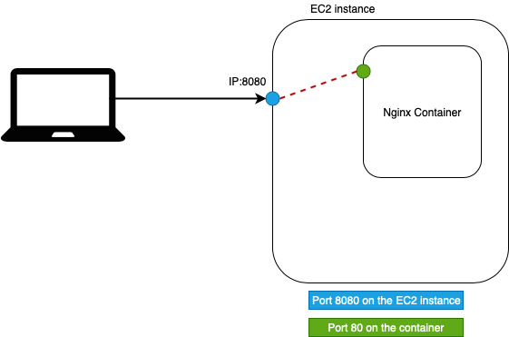

# Lab 04 - Running your first Docker containers

After installing docker and using some basic commands we are ready to run our very
first docker container!

## Task 1: Hello world!

To run your very first (one-off) container, simply execute the following command
in your terminal:

        docker run gluobe/hello-world

When succesful you will be prompted with the following output (read the output
carefully to better understand all the technical things that happened behind the
scenes in order to produce this output):

        ##############################################################################
        ###                               Hello world!                             ###
        ##############################################################################

                                           ##         .
                                     ## ## ##        ==
                                  ## ## ## ## ##    ===
                              /"""""""""""""""""\___/ ===
                             {                       /  ===-
                              \______ O           __/
                                \    \         __/
                                 \____\_______/

        ##############################################################################

        Hello from Docker!
        This message shows that your installation appears to be working correctly.

        To generate this message, Docker took the following steps:
         1. The Docker client contacted the Docker daemon.
         2. The Docker daemon pulled the "gluobe/hello-world" image from the Docker Hub.
         3. The Docker daemon created a new container from that image which runs the
            executable that produces the output you are currently reading.
         4. The Docker daemon streamed that output to the Docker client, which sent it
            to your terminal.
         5. As soon as the executable finished the container is terminated by the Docker
            daemon.

        To try something more ambitious, you can run an Ubuntu container with:
         $ docker run -it ubuntu bash

        Share images, automate workflows, and more with a free Docker ID:
         https://hub.docker.com/

        For more examples and ideas, visit:
         https://docs.docker.com/get-started/#

        ##############################################################################

## Task 2: Run and connect to nginx container

A better example for this workshop would be an `nginx` container. This is a container
with the `nginx` service inside. This deployment needs a port mapping to reach
our service. What we need to do is map the container port `80` to a port on our
host `instance` the port on our instance is going to be `8080`. We can do this with
the `-p` option in the `run` command.

        docker run --name some-nginx -d -p 8080:80 nginx

You could use the command `ps` that we have seen in a previous lab to discover the
container.

        docker ps -a

        CONTAINER ID        IMAGE               COMMAND                  CREATED             STATUS              PORTS                  NAMES
        7cc74f9ace0a        nginx               "nginx -g 'daemon of…"   3 seconds ago       Up 2 seconds        0.0.0.0:8080->80/tcp   some-nginx

The result of our `-p` command is also visable in this output. At the `PORTS` section
you can see that our localhost `0.0.0.0` port `8080` is mapped to the `80` port
of the container.

Visit the service with in your browser on `workshop_instance<number>.gluo.cloud`
and you should see a working `nginx` deployment.

## Task 5: Use the basic commands to list the containers you created

With the commands learned in the previous lab you should be able to list all the containers that
are currently running and also the containers that are stopped.

        docker ps

        CONTAINER ID        IMAGE               COMMAND                  CREATED             STATUS              PORTS                  NAMES
        985a5a437a50        nginx               "nginx -g 'daemon of…"   9 seconds ago       Up 8 seconds        0.0.0.0:8080->80/tcp   some-nginx

        docker ps -a
        CONTAINER ID        IMAGE                COMMAND                  CREATED             STATUS                      PORTS                  NAMES
        985a5a437a50        nginx                "nginx -g 'daemon of…"   45 seconds ago      Up 44 seconds               0.0.0.0:8080->80/tcp   some-nginx
        d9e40e275ac7        gluobe/hello-world   "cat /hello.txt"         59 seconds ago      Exited (0) 58 seconds ago                          eager_lederberg

        docker images

        REPOSITORY           TAG                 IMAGE ID            CREATED             SIZE
        nginx                latest              53f3fd8007f7        3 weeks ago         109MB
        gluobe/hello-world   latest              ac40b9130319        2 months ago        1.2MB

## Task 6: clean up

To clean up run the following command:

        docker system prune
