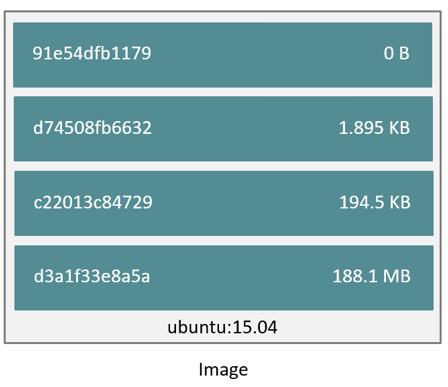

# Lab 05 - Creating and sharing your own Docker images

In this lab we will focus on Docker images.  We will learn what they are, where
to look for them and even explore the possibility of building our very own
Docker images.

Docker images are a series of read-only layers that are stacked on top of each
other to form a single unified view. The first image in the stack is called a
*base image* and all the other layers are stacked on top of this layer. The
diagram below shows the Ubuntu 15:04 image comprising 4 stacked image layers.

When you make a change to a Docker images, for example, adding a new file to
the Ubuntu 15.04 image, you add a new layer on top of the underlying image
stack. This change creates a new image layer containing the newly added file.
Each image layer has its own universal unique identifier (UUID) and each
successive image layer builds on top of the image layer below it.

Containers (in the storage context) are a combination of a Docker image with a
thin writable layer added to the top, known as the *container layer*.  The
diagram below shows the differnt layers of a container running the Ubuntu 15.04
image.

So the major difference between a container and an image is this writable layer.
All changes made to the container that adds new or modifies existing data are
stored in this writable layer. When the container is deleted the writable layer
is also deleted. The image remains unchanged. The container is hence immutable.

## Task 1: Searching for images

You can run containers from images that you built yourself or from images that
you pulled from a containers registry (all images from the previous lab were
pulled from the public container registry named Docker Hub). Docker Hub has
millions of images that are created and shared by regular users. Additionally,
Docker Hub hosts official images ( e.g Ubuntu, Nginx, Redis, and Mongo) that are
created and maintained by their respective companies.

Issue the following commands and observe the output:

        docker search nginx

When you execute this command you will search Docker Hub for all images that
contain the word 'nginx' in them.

Alternatively you can search Docker Hub from the web by going to
https://hub.docker.com/.

You will notice that the search results include an `OFFICIAL` column. Official
images are certified by Docker to indicate that they are built using certain
standards. You will find a list of official images at the link below:
https://github.com/docker-library/official-images/tree/master/library

## Task 2: Pulling images from a registry

Once you have identified an image you want to use you can `pull` it from the
registry.  Pulling an image means that you will download it to your local system
(laptop).

Use the command below to pull the `nginx` image:

        docker pull nginx

Your output should be something like:

        Using default tag: latest
        latest: Pulling from library/nginx
        743f2d6c1f65: Pull complete
        6bfc4ec4420a: Pull complete
        688a776db95f: Pull complete
        Digest: sha256:23b4dcdf0d34d4a129755fc6f52e1c6e23bb34ea011b315d87e193033bcd1b68
        Status: Downloaded newer image for nginx:latest

To see which images you have pulled/cached locally issue the command below:

        docker images

The output of the above command should look something like (pay special
attention to the `SIZE` of the images):

        REPOSITORY           TAG                 IMAGE ID            CREATED             SIZE
        gluobe/hello-world   latest              ed96b620d6ab        7 hours ago         1.2MB
        busybox              latest              d8233ab899d4        7 days ago          1.2MB
        nginx                latest              f09fe80eb0e7        2 weeks ago         109MB
        ubuntu               latest              47b19964fb50        2 weeks ago         88.1MB
        centos               latest              1e1148e4cc2c        2 months ago        202MB

In the above output you will also notice a `TAG` column, tags representspecific
versions of the image, if no tag is specified the 'latest' tag is being used.

        docker pull centos:6
        docker pull centos:7

> NOTE: the `latest` tag can often be confusing as there could be more recent
> images with a different tags, it is best-practice to always use a specific tag
> when working with Docker images

## Task 3: building your own Docker images (automated)

Obviously the manual procedure from the previous task is not something you want
to use when building a multitude of images.  What you would want instead is to
use is an automated procedure, and that is exactly what `Dockerfile` provides.

A Dockerfile is a text file that contains all the commands, in order, needed to
build a given image. A primary advantage of Dockerfile is version control and
documentation.

A Dockerfile details all the steps used to create a particular image.
Dockerfiles adhere to a specific format and require a specific instruction
syntax.

Some common commands used in Dockerfile are:
* `FROM` : sets the base image
* `RUN` : executes a command in the container
* `WORKDIR` : sets the working directory
* `EXPOSE` : exposes a port
* `CMD` : sets the executable for the container

Check the page below for the complete reference guide on Dockerfile:
https://docs.docker.com/engine/reference/builder/

Create (vim, nano,...) a file with the following content, and save it into your
current working directory with the name `Dockerfile` (important that you do not
specify a file extention):

        FROM nginx

        COPY html/index.html /usr/share/nginx/html/index.html
        COPY html/i-know-docker.jpg /usr/share/nginx/html/i-know-docker.jpg

To build a new image using the above Dockerfile run the following command:

        docker build -t my_nginx .

> NOTE: the `.` at the end of the command is very important, it tells the build
> command to search for the `Dockerfile` in the current (`.`) directory

Test with:

        docker run -p 8080:80 -d my_nginx

You should be able to browse to your instance `IP` again and find an updated
`Nginx` service with an image and custom `html`.

## Task 5: pushing Docker images to a registry

A Docker registry is a repository where Docker images can be pulled from or
pushed to. In concept they are the same as Git repositories, only instead of
code you push/pull Docker images.

The most known Docker registry is the [Docker Hub](https://hub.docker.com),
think of it as the GitHub of Docker images.  But course there are many other
Docker repositories that you can use (GCR, ECR, Quay.io, Nexus, Artifactory,.. )

Just like with Git repositories, you can choose to make Docker images public or
private in the Docker registry.  Public images can be pulled by everybody (no
authentication/authorization required), private images require you to
authenticate and that you have the necessary permissions.  To push, most Docker
registries require you to first authenticate.

To authenticate to the Docker Hub run the following command:

        docker login

> NOTE: when you do not specifically specify a registry host, it will assume
> that you want to login into the Docker Hub, should you want to login into
> a different registry simply add it to the command `docker login quay.io`

When you want to push images to the Docker Hub you will need te prefix your
image name with your Docker Hub username.  Again, this is similar to how
namespacing is handled on GitHub.

Because the Docker Hub username differs for everybody we will work with a
variable, this way you can keep copy/pasting the following commands:

        export DOCKER_HUB_USERNAME=<YOUR_DOCKER_HUB_USERNAME>

Before we can push an image, we need to re-tag (rename) the image we created in
the previous task so it includes our username:

        docker tag my_nginx ${DOCKER_HUB_USERNAME}/my_nginx:1

> NOTE: when you do not specifically specify a registry host, it will push the
> image to the Docker Hub, should you want to push to a different registry,
> simply add it `docker tag my_nginx quay.io/${DOCKER_HUB_USERNAME}/my_nginx:1`

You should see at least 2 images now when you run `docker image ls`, one
`${DOCKER_HUB_USERNAME}/my_nginx:1` and one `my_nginx`:

        REPOSITORY                         TAG                 IMAGE ID            CREATED             SIZE
        trescst/my_nginx:1                 1                   1e9c0ff2dc02        3 hours ago         288MB
        my_nginx                           latest              1e9c0ff2dc02        3 hours ago         288MB

To push the image to the Docker Hub run the following command:

        docker push ${DOCKER_HUB_USERNAME}/my_nginx:1

If you should see something like the output below:

        The push refers to repository [docker.io/trescst/my_nginx]
        4a92a20976a5: Layer already exists
        071d8bd76517: Layer already exists
        7: digest: sha256:06d67383803e113bda94e3fb782a9e81c41665a5b4ab514c8b9d6c6b88de9f54 size: 741

## Task 6: sharing images

The image you just pushed will be  public by default, so they can easily be
shared with your colleagues. So share your image name on Slack so your
colleagues can test your image (and you can test their image).

        docker run <COLLEAGUE_DOCKER_HUB_USERNAME>/my_nginx:1

## Task 7: clean up

To clean up run the following commands:

        docker system prune
        unset DOCKER_HUB_USERNAME
